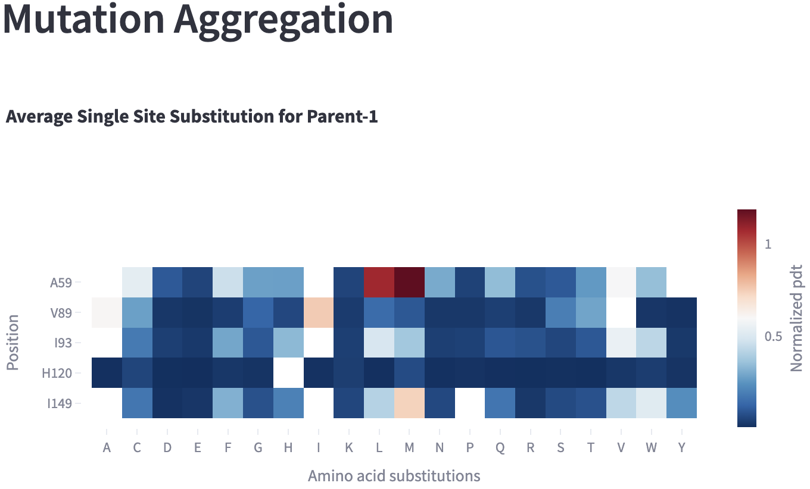
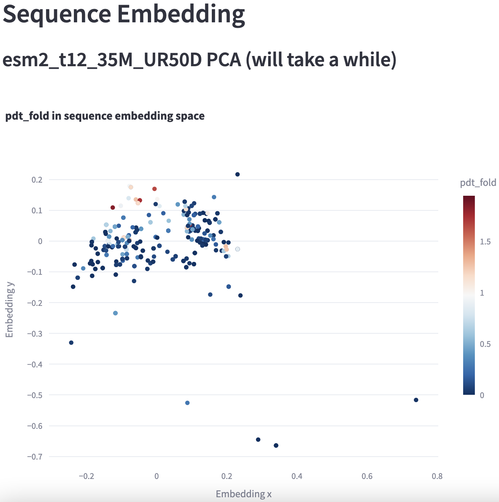

# A Beta project LevSeq vis

Web app for combining and visualising [LevSeq](https://github.com/fhalab/LevSeq) sequence function data.

Test it out with the [data](data/) in the data folder. Use the columns in the screenshot below. 

Once you have your figures you can download the csv results by hovering on any of the tables.

## Upload with data

Using the `visualization_partial.csv` file as the variant file and the `300-1` in the `ep1` folder.
Support multiple fitness fites so long as they are included in the sequence file.

### Tables for download
We join the data based on user selected columns (in this case `cis` and `trans`) from a LC-MS run.


### Overview of alignment count
The alignment count is how many reads assigned to each type were assigned to each well.


### Scatterplot of multiple features
This shows the fitness values of two plotted against eachother, if only one feature is provided we will plot it against 
the alignment count.


### Bar plot for all variants for each parent
This shows the fitness values of all variants for each given parent.


### Heatmap for single amino acid substitutions
This shows the fitness values of all variants averaged across each single amino acid subsitution for each given parent. Most useful for SSM data.


### Bar plot for each targed site amino acid substitution
This shows the fitness values of all variants averaged across each single amino acid subsitution for each given site of a given parent. Most useful for SSM data.


### Sequence embedding PCA
This shows the PCA of the sequence embeddings for each variant colored by the fitness value.


## Please provide feedback
Leave a feature request in the issues or on [LevSeq](https://github.com/fhalab/LevSeq) . 

## Cite
Cite our [paper](https://doi.org/10.1101/2024.09.04.611255) please if you use it.

## Developers

```
streamlit run app.py
```

## References
Streamlit app based on: https://share.streamlit.io/streamlit/example-app-csv-wrangler/
Thanks to you who made it <3 